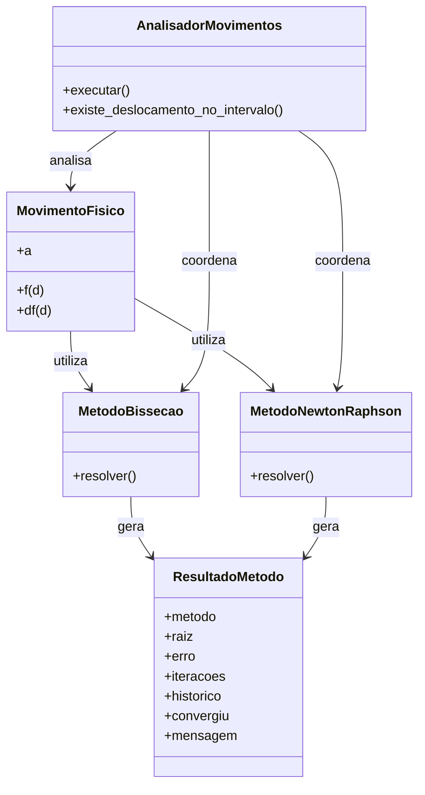

# Diagrama de Classes

```mermaid
classDiagram
    MovimentoFisico --> MetodoBissecao : utiliza
    MovimentoFisico --> MetodoNewtonRaphson : utiliza
    MetodoBissecao --> ResultadoMetodo : gera
    MetodoNewtonRaphson --> ResultadoMetodo : gera
    AnalisadorMovimentos --> MetodoBissecao : coordena
    AnalisadorMovimentos --> MetodoNewtonRaphson : coordena
    AnalisadorMovimentos --> MovimentoFisico : analisa

    class MovimentoFisico {
        +a
        +f(d)
        +df(d)
    }
    class ResultadoMetodo {
        +metodo
        +raiz
        +erro
        +iteracoes
        +historico
        +convergiu
        +mensagem
    }
    class MetodoBissecao {
        +resolver()
    }
    class MetodoNewtonRaphson {
        +resolver()
    }
    class AnalisadorMovimentos {
        +executar()
        +existe_deslocamento_no_intervalo()
    }
```
